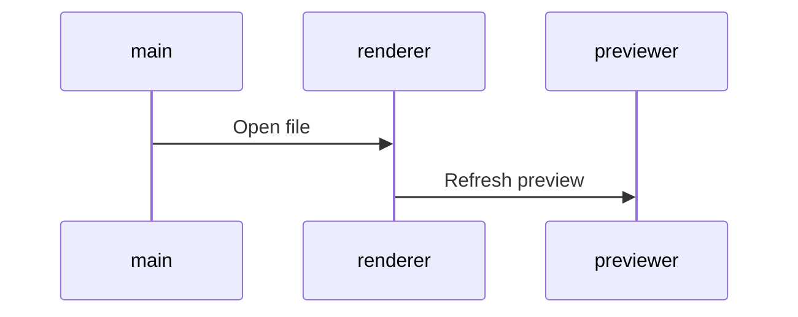

## planning 

### à valider | à intégrer | [checked](dl2018done.md)

| brand | job       | intitulé              | deadline   | date | état      |
| :---: | ----      | ------------          | ---------- | ---- | ---:      |
| TL+ID | EC int    | TH15_Repas_Table_Fete | 05/11/2018 | nov  | wip       |
| HO    | news_CSOA | pereNoel-CV           | 12/11/2018 | nov  | vérif-int |
| CV+VF | news_CSOA | pereNoel-CV           | 12/11/2018 | nov  | vérif-int |

### TL + ID

| brand | job      | intitulé              | deadline   | date | date-n   |
| :---: | -------  | ---------------       | ---------- | ---- | :------- |
| TL    | news int | livr_express          | 22/11/18   | nov  | 08/11/18 |
| TL    | news     | relance Cat           | 26/11/18   | dec  | -        |
| ID    | news     | relance Cat           | 26/11/18   | dec  | -        |
| TL+ID | news     | OM22                  | 03/12/18   | dec  | -        |
| TL+ID | news     | catalogue             | 27/12/18   | janv | -        |

date-n >> [ **_"TH0n" et "offre du mois n" "News cat + rCat" = deadline -14 jours_** ](./fctRm14Days.html)

### AL

| brand | job       | intitulé    | deadline | date | date-n |
| :---: | ----      | ---------   | -------- | ---- | ----   |
| AL    | site      | bg_noel     | 01/12/18 | oct  | -      |
| AL    | EC        | hp          | 29/11/18 | dec  | -      |
| AL    | news      | catalogue   | 03/12/18 | dec  | -      |

### HO

| brand | job       | intitulé    | deadline | date | date-n |
| :---: | ----      | ---------   | -------- | ---- | ----   |
| HO    | site      | bg_noel     | 01/12/18 | oct  | -      |
| HO    | news      | catalogue   | 02/12/18 | dec  | -      |
| HO    | EC        | hp          | 04/12/18 | dec  | -      |

### CD

| brand | job  | intitulé  | deadline | date | date-n |
| :---: | ---- | --------- | -------- | ---- | ----   |
| CD    | site | bg_noel   | 01/12/18 | oct  | -      |
| CD    | EC   | hp        | 21/11/18 | dec  | -      |
| CD    | news | catalogue | 28/12/19 | janv | -      |

### CV + VF

| brand | job       | intitulé    | deadline | date | date-n |
| :---: | ----      | ---------   | -------- | ---- | ----   |
| CV    | site      | bg_noel     | 01/12/18 | oct  | -      |
| CV+VF | EC        | hp          | 04/12/18 | dec  | -      |
| CV    | news      | catalogue   | 03/12/18 | dec  | -      |

_email auto modifier la couleur des picto assurance_

### MM

| brand | job  | intitulé  | deadline | date | date-n |
| :---: | ---- | --------  | -------- | ---- | ----   |
| MM    | site | bg_noel   | 01/12/18 | oct  | -      |
| MM    | EC   | hp        | 29/11/18 | dec  | -      |
| MM    | news | catalogue | 10/12/18 | dec  | -      |

* Start 13 mars 2017
* End

### infos

<pre>
	<code>
	- ctrl       = contrôle
	- nodef      = non définie
	- allb       = all brand
	- NOK        = Non OK
	- EC         = encart central
	- int        = intégration
	- trad       = version inter
	- v1 | v2... = à valider !important
	- wip        = job en cours
	- DPO        = Data Privacy Officer
	- EAN        = European Article Numbering
	</code>
</pre>

### TODO as soon as possible

_bash cmd_

<!-- - fct create $date_cov_folder <span style="color: chartreuse;">OK > @see covcv C:\cygwin64\bin\</span> -->

* <span style="color: chartreuse;">create new cmd mvCat mvLoc mvEvt > move img from optz to current folder.</span> - ok pour relance cat IDEAL cf fct/bin imgrcat arg1 arg2 BV DE etc...
* time notification
* regex-lookahead

_javascript_

* Evt > babel > auto create babelrc
* gulp remplacer progressivement les callback par des promises
* gulp ajouter la suppression des éléments dans le rendu - supp img ds dist si supp ds dev
* automatiser les variables les plus courantes

```javascript
$s1_accroche = $url+rayon+$IDray[:pays]+srcMedCont+auto(accroche)+$campaign
```

_design_

* transition Fireworks vers <s>adobe XD(maturité nok)</s> Affinity Designer ??? ou Sketch ( ++ prix bas : 80€/an -- OSX only ).

_Nodejs_

* install NVM (nodist) gestion de version Nodejs pour sécuriser flux production.

_Gulp_

* uniformiser les différents templates de news pour avoir un workflow strictement identique. - <span style="color: chartreuse;">solution automatiser création des variables cf news rPannier</span>
* AL CD CV HO MM TL news catalogue
* TL ID news loco
* suppression des dossiers evtProd preview et zipped à chaque lancement de gulp dev <span style="color: chartreuse;">TL(newsLoco/EC/ZL) ok</span>
* @see /cygdrive/c/Users/mdevries/Pictures/TL/evnt/first/0817/TH12_ete/code/evt - à propager sur toutes les enseignes et sur tous les postes.
* corriger le rendu des balises img sur deux lignes @see /cygdrive/c/Users/mdevries/Pictures/tl/newsLetter/loco/0917/OM8/HTML/BVNL/gulpfile.js

### résolution css spécifique aux news cross-client

* lien qui prend toute la place de son conteneur width et height
* d:table-cell; width: ..px; height: ..px; va:m; // cette solution ne fonctionne pas sur outlook 2014
* CV > re factorisation du code : pkX3 (loop ok img nok lib + link)

### Cheatsheet 

_img | list | title | code | etc..._

```css
.testColor {
  color: red;
}
```

```javascript
function test(arg) {
  return arg;
}
```

```html
<h1 class="testColor">Mon titre de niveau 1</h1>
```

```markdown
images :

```

```uiflow
[top page]
user name
password
--
login
==>mypage

[mypage]
favorite list
```



### Work in progress

``` javascript
javascript les tests unitaires
  mocha (moka) qui tourne sur noyau node avec solution browser et dom
  npm chai (chaïlle) pour ajouter syntaxe deep.equal etc...
  @see gulp-mocha
```
