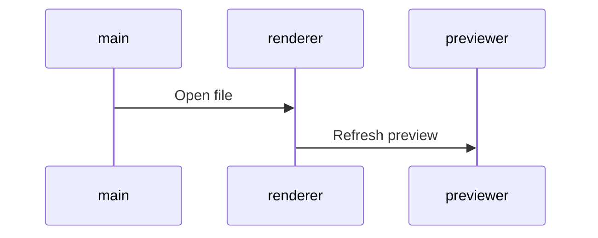

## planning

### à valider | à intégrer | [checked](dl2018done.md)

| brand | job  | intitulé     | deadline   | date | info | dossier | état |
| :---: | ---- | ------------ | ---------- | ---- | :--: | :-----: | ---: |
| TL+ID | news | TH07_saladeC | 14/05/2018 | mai  |  ok  |    x    |  int |
|   -   | -    | -            | -          | -    |  -   |    -    |    - |

### TL + ID

| brand | job     | intitulé        | deadline   | date | info | dossier | état | date-n   |
| :---: | ------- | --------------- | ---------- | ---- | :--: | :-----: | :--: | :------- |
| TL+ID | EC      | TH07_saladeC    | 14/05/2018 | mai  |  ok  |    x    |  x   | 30/04/18 |
|  TL   | news    | fdm             | 27/05/18   | mai  |  ok  |    x    |  x   | 13/05/18 |
|  TL   | news    | catalogue       | 29/05/18   | juin |  ok  |   ok    |  x   | 15/05/18 |
|  ID   | news    | catalogue       | 29/05/18   | juin |  ok  |   ok    |  x   | 15/05/18 |
| TL+ID | news    | TH08_Confitures | 04/06/18   | juin |  ok  |    x    |  x   | 21/05/18 |
| TL+ID | EC      | TH08_Confitures | 04/06/18   | juin |  ok  |    x    |  x   | 21/05/18 |
|  TL   | news    | relance Cat     | 11/06/18   | juin |  ok  |   ok    |  x   | 28/05/18 |
|  ID   | news    | relance Cat     | 11/06/18   | juin |  ok  |   ok    |  x   | 28/05/18 |
|  TL   | news    | surpression     | 18/06/18   | juin |  ok  |    x    |  x   | 04/06/18 |
|  TL   | landing | surpression     | 18/06/18   | juin |  ok  |    x    |  x   | 04/06/18 |
|  TL   | news    | voyage          | 19/06/18   | juin |  ok  |    x    |  x   | 05/06/18 |

date-n >> [ **_"TH0n" et "offre du mois n" "News cat + rCat" = deadline -14 jours_** ](./fctRm14Days.html)

<!-- | TL    | news-land | surpression      | 02/01/2018 | jan  | x     | x       | x     |            | -->

### AL

| brand | job  | intitulé  | deadline | date | info | dossier | état | cover |
| :---: | ---- | --------- | -------- | ---- | :--: | :-----: | ---- | :---- |
|  AL   | news | catalogue | 07/06/18 | juin |  x   |   ok    | x    | ok    |
|  AL   | EC   | hp        | 07/06/18 | juin |  x   |   ok    | x    |

### HO

| brand | job  | intitulé  | deadline | date | info | dossier | état | cover |
| :---: | ---- | --------- | -------- | ---- | :--: | :-----: | ---- | :---- |
|  HO   | news | catalogue | 16/05/18 | mai  |  ok  |   ok    | x    | x     |
|  HO   | EC   | hp        | 16/05/18 | mai  |  ok  |   ok    | x    |

### CD

| brand | job  | intitulé  | deadline | date | info | dossier | état | cover |
| :---: | ---- | --------- | -------- | ---- | :--- | :-----: | ---- | :---- |
|  CD   | news | catalogue | 23/05/18 | juin | x    |   ok    | x    | x     |
|  CD   | EC   | hp        | 23/05/18 | juin | ok   |   ok    | x    |

### CV + VF

| brand | job  | intitulé  | deadline | date | info | dossier | état | cover |
| :---: | ---- | --------- | -------- | ---- | :--: | :-----: | ---- | :---- |
| CV+VF | EC   | hp        | 15/05/18 | mai  |  x   |    x    | x    | ok    |
|  CV   | news | catalogue | 15/05/18 | mai  |  X   |   ok    | x    |

_email auto modifier la couleur des picto assurance_

### MM

| brand | job  | intitulé | deadline | date | info | dossier | état | cover |
| :---: | ---- | -------- | -------- | ---- | :--: | :-----: | ---- | :---- |
|  MM   | news | cat      | 05/06/18 | juin |  x   |    x    | x    | x     |
|  MM   | EC   | hp       | 05/06/18 | juin |  x   |    x    | x    |

* Start 13 mars 2017
* End

### infos

<pre>
	<code>
	- nodef      = non définie
	- allb       = all brand
	- NOK        = Non OK
	- EC         = encart central
	- int        = intégration
	- trad       = version inter
	- v1 | v2... = à valider !important
	- wip        = job en cours
	- DPO        = Data Privacy Officer
	- FR         = délégué à la protection des données
	- EAN        = European Article Numbering
	</code>
</pre>

### TODO as soon as possible

_bash cmd_

<!-- - fct create $date_cov_folder <span style="color: chartreuse;">OK > @see covcv C:\cygwin64\bin\</span> -->

* <span style="color: chartreuse;">create new cmd mvCat mvLoc mvEvt > move img from optz to current folder.</span> - ok pour relance cat IDEAL cf fct/bin imgrcat arg1 arg2 BV DE etc...
* time notification
* regex-lookahead

_javascript_

* Evt > babel > auto create babelrc
* gulp remplacer progressivement les callback par des promises
* gulp ajouter la suppression des éléments dans le rendu - supp img ds dist si supp ds dev
* automatiser les variables les plus courantes

```javscript
$s1_accroche = $url+rayon+$IDray[:pays]+srcMedCont+auto(accroche)+$campaign
```

_design_

* transition Fireworks vers <s>adobe XD(maturité nok)</s> Affinity Designer ??? ou Sketch ( ++ prix bas : 80€/an -- OSX only ).

_Nodejs_

* install NVM (nodist) gestion de version Nodejs pour sécuriser flux production.

_Gulp_

* uniformiser les différents templates de news pour avoir un workflow strictement identique. - <span style="color: chartreuse;">solution automatiser création des variables cf news rPannier</span>
* AL CD CV HO MM TL news catalogue
* TL ID news loco
* suppression des dossiers evtProd preview et zipped à chaque lancement de gulp dev <span style="color: chartreuse;">TL(newsLoco/EC/ZL) ok</span>
* @see /cygdrive/c/Users/mdevries/Pictures/TL/evnt/first/0817/TH12_ete/code/evt - à propager sur toutes les enseignes et sur tous les postes.
* <span style="color: chartreuse;">corriger le rendu des balises img sur deux lignes @see /cygdrive/c/Users/mdevries/Pictures/tl/newsLetter/loco/0917/OM8/HTML/BVNL/gulpfile.js</span>

### résolution css spécifique aux news cross-client

* lien qui prend toute la place de son conteneur width et height
* d:table-cell; width: ..px; height: ..px; va:m; // cette solution ne fonctionne pas sur outlook 2014
* CV > re factorisation du code : pkX3 (loop ok img nok lib + link)

### Cheatsheet 

_img | list | title | code | etc..._

```css
.testColor {
  color: red;
}
```

```javascript
function test(arg) {
  return arg;
}
```

```html
<h1 class="testColor">Mon titre de niveau 1</h1>
```

```markdown
images :

```

```uiflow
[top page]
user name
password
--
login
==>mypage

[mypage]
favorite list
```


