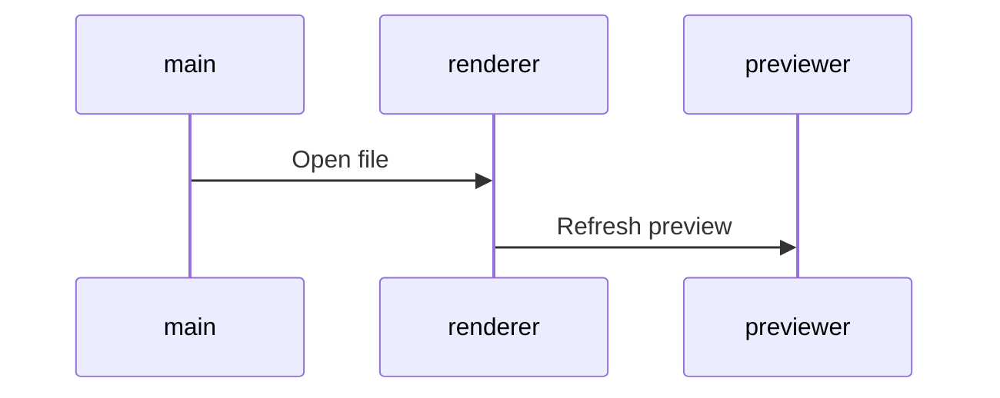

## planning

### à valider | à intégrer | [checked](dl2018done.md)

| brand | job  | intitulé     | deadline   | date    | info | dossier | état     |
| :---: | ---- | ------------ | ---------- | ----    | :--: | :-----: | ---:     |
| HO    | news | catalogue    | 17/07/2018 | juillet | ok   | ok      | vers     |
| TL+ID | EC   | TH10_BBQ     | 16/07/2018 | juillet | ok   | ok      | vers     |
| TL+ID | news | TH10_BBQ     | 17/07/2018 | juillet | ok   | ok      | version1 |
| CV    | news | catalogue    | 10/07/2018 | juillet | ok   | ok      | version2 |
| -     | -    | -            | -          | -       | -    | -       | -        |

### TL + ID

| brand | job     | intitulé        | deadline   | date    | info | dossier | état | date-n   |
| :---: | ------- | --------------- | ---------- | ----    | :--: | :-----: | :--: | :------- |
| TL    | news    | catalogue       | 24/07/18   | aout    | ok   | ok      | x    | 10/07/18 |
| TL+ID | news    | TH11_apero      | 06/08/18   | aout    | ok   | ok      | x    | 23/07/18 |

date-n >> [ **_"TH0n" et "offre du mois n" "News cat + rCat" = deadline -14 jours_** ](./fctRm14Days.html)

<!-- | TL+ID  <td colspan=7> @Isabelle R. 9h00 TH10_BBQ récup PK + img ambiance 26/06/18 | 25/06/18  -->

### AL

| brand | job  | intitulé  | deadline | date | info | dossier | état |
| :---: | ---- | --------- | -------- | ---- | :--: | :-----: | ---- |
| AL    | news | catalogue | 08/08/18 | aout | x    | ok      | x    |
| AL    | EC   | hp        | 06/08/18 | aout | x    | ok      | x    |

### HO

| brand | job  | intitulé  | deadline | date | info | dossier | état |
| :---: | ---- | --------- | -------- | ---- | :--: | :-----: | ---- |
| HO    | news | catalogue | 14/08/18 | aout | x    | ok      | x    |
| HO    | EC   | hp        | 14/08/18 | aout | x    | ok      | x    |

### CD

| brand | job  | intitulé  | deadline | date | info | dossier | état |
| :---: | ---- | --------- | -------- | ---- | :--- | :-----: | ---- |
| CD    | news | catalogue | 17/07/18 | aout | x    | ok      | x    |
| CD    | EC   | hp        | 20/07/18 | aout | ok   | ok      | x    |

### CV + VF

| brand | job  | intitulé  | deadline | date | info | dossier | état |
| :---: | ---- | --------- | -------- | ---- | :--: | :-----: | ---- |
| CV+VF | EC   | hp        | 10/08/18 | aout | x    | ok      | x    |
| CV    | news | catalogue | 06/08/18 | aout | X    | ok      | x    |

_email auto modifier la couleur des picto assurance_

### MM

| brand | job  | intitulé | deadline | date | info | dossier | état |
| :---: | ---- | -------- | -------- | ---- | :--: | :-----: | ---- |
| MM    | news | cat      | 14/08/18 | aout | x    | x       | x    |
| MM    | EC   | hp       | 03/08/18 | aout | x    | x       | x    |

* Start 13 mars 2017
* End

### infos

<pre>
	<code>
	- ctrl       = contrôle
	- nodef      = non définie
	- allb       = all brand
	- NOK        = Non OK
	- EC         = encart central
	- int        = intégration
	- trad       = version inter
	- v1 | v2... = à valider !important
	- wip        = job en cours
	- DPO        = Data Privacy Officer
	- EAN        = European Article Numbering
	</code>
</pre>

### TODO as soon as possible

_bash cmd_

<!-- - fct create $date_cov_folder <span style="color: chartreuse;">OK > @see covcv C:\cygwin64\bin\</span> -->

* <span style="color: chartreuse;">create new cmd mvCat mvLoc mvEvt > move img from optz to current folder.</span> - ok pour relance cat IDEAL cf fct/bin imgrcat arg1 arg2 BV DE etc...
* time notification
* regex-lookahead

_javascript_

* Evt > babel > auto create babelrc
* gulp remplacer progressivement les callback par des promises
* gulp ajouter la suppression des éléments dans le rendu - supp img ds dist si supp ds dev
* automatiser les variables les plus courantes

```javscript
$s1_accroche = $url+rayon+$IDray[:pays]+srcMedCont+auto(accroche)+$campaign
```

_design_

* transition Fireworks vers <s>adobe XD(maturité nok)</s> Affinity Designer ??? ou Sketch ( ++ prix bas : 80€/an -- OSX only ).

_Nodejs_

* install NVM (nodist) gestion de version Nodejs pour sécuriser flux production.

_Gulp_

* uniformiser les différents templates de news pour avoir un workflow strictement identique. - <span style="color: chartreuse;">solution automatiser création des variables cf news rPannier</span>
* AL CD CV HO MM TL news catalogue
* TL ID news loco
* suppression des dossiers evtProd preview et zipped à chaque lancement de gulp dev <span style="color: chartreuse;">TL(newsLoco/EC/ZL) ok</span>
* @see /cygdrive/c/Users/mdevries/Pictures/TL/evnt/first/0817/TH12_ete/code/evt - à propager sur toutes les enseignes et sur tous les postes.
* corriger le rendu des balises img sur deux lignes @see /cygdrive/c/Users/mdevries/Pictures/tl/newsLetter/loco/0917/OM8/HTML/BVNL/gulpfile.js

### résolution css spécifique aux news cross-client

* lien qui prend toute la place de son conteneur width et height
* d:table-cell; width: ..px; height: ..px; va:m; // cette solution ne fonctionne pas sur outlook 2014
* CV > re factorisation du code : pkX3 (loop ok img nok lib + link)

### Cheatsheet 

_img | list | title | code | etc..._

```css
.testColor {
  color: red;
}
```

```javascript
function test(arg) {
  return arg;
}
```

```html
<h1 class="testColor">Mon titre de niveau 1</h1>
```

```markdown
images :

```

```uiflow
[top page]
user name
password
--
login
==>mypage

[mypage]
favorite list
```


