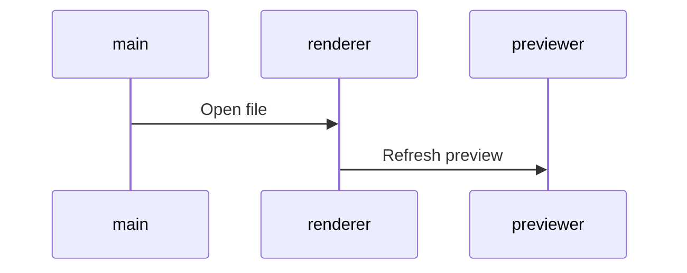

# planning

## priorités

- Marie Lefebvre Date : Lundi 23 mars 2020 09:07 objet : TR: CALL
- **titre modif**
- modif ttes enseignes
- 8H 17H du lundi au samedi FR et Belgique Wallonne Domoti //Becquet
- 8H 16H Lundi au vendredi NL/FL
- 9H 17H Lundi au vendredi DE
- 9H 17H heure locale Lundi au vendredi UK

<!-- | allBrand | news  | rPanier Abandonné        | 31/01/2019 | fev | V1 à valider | Manu | -->

<!-- [checked](./dl2020done.md)  -->
### à valider | à intégrer | [checked](./planmd_done.html)

| brand    | job       | intitulé                             | deadline   | date | état      |
| : ---:   | --------- | -----------                          | ---------- | ---- | --------: |
| MM       | EC        | hp                                   | 04/06/2020 | jun  | ok        |
| TL       | E1 + E2   | Nouveau site décli à table et jardin | 02/06/2020 | jun  | -         |
| IP       | news      | OM 0520                              | 01/06/2020 | jun  | -         |
| AllBrand | site      | Création P1 E-cata HTML5             | 20/04/2020 | mai  | ok        |
| TL       | E1 newTL  | TH10 conservation                    | 08/06/2020 | jun  | V1        |
| HO       | EC        | hp                                   | 19/05/2020 | mai  | -         |
| TL       | newSite   | A propos de nous                     | 25/10/2019 | nov  | v1        |
| TL       | newSite   | encarts_univers_BAF&nouveautes       | 15/04/2020 | mar  | -         |
| TL       | newSite   | encarts_univers_pdtMois&video        | 15/04/2020 | mar  | -         |
| TL+IP    | news      | TH - Gdes idées pour la planète      | 19/05/2020 | mai  | v1        |
| TL       | news      | TH Fête Des Mères -> Jeremy          | 01/06/2020 | jun  | inté ok   |

### TL + ID

<!--
rCat Juin I:\NEWSLETTERS\NEWSLETTERS-2020\TEMPSL_IDEAL-PRATIQUE\0620\CATA\TEMPSL\source-Anais
| TL | E2       | Anti insectes          | 25/05/20 | jun | - |
| TL | visuelFB | Anti insectes          | 25/05/20 | jun | - |
| TL | news     | Anti insectes          | 25/05/20 | jun | - |
| TL | E1       | TH10- Eco, Dev Durable | 08/06/20 | jun | - |
| TL | visuelFB | TH10- Eco, Dev Durable | 08/06/20 | jun | - |
| TL | news     | TH10- Eco, Dev Durable | 08/06/20 | jun | - |
-->

| brand  | jobs     | intitulé                     | deadline | date | date-n |
| : ---: | -------  | ---------------------------- | -------- | ---- | ------ |
| TL     | E3       | Fête des mères               | 01/06/20 | jun  | -      |
| TL     | visuelFB | Fête des mères               | 01/06/20 | jun  | -      |
| TL     | E2       | Spécial Microfibre ?         | 01/06/20 | jun  | -      |
| IP     | news     | catalogue                    | 08/06/20 | jun  | -      |
| TL     | news     | TH10 conservation            | 15/06/20 | jun  | -      |
| TL+IP  | news     | rCat see comment above       | 08/06/20 | jun  | -      |
| TL     | E2       | Jardinage P.2/3 Juin         | 15/06/20 | jun  | -      |
| TL     | visuelFB | Jardinage P.2/3 Juin         | 15/06/20 | jun  | -      |
| TL     | news     | Jardinage P.2/3 Juin         | 15/06/20 | jun  | -      |
| TL     | news     | Recette                      | 15/06/20 | jun  | -      |
| TL     | E3       | Sélection Été                | 15/06/20 | jun  | -      |
| TL     | visuelFB | Sélection Été                | 15/06/20 | jun  | -      |
| TL     | news     | OM 0620                      | 15/06/20 | jun  | -      |
| IP     | news     | OM 0620                      | 15/06/20 | jun  | -      |
| TL     | E2       | Apéro jardin                 | 22/06/20 | jul  | -      |
| TL     | visuelFB | Apéro jardin                 | 22/06/20 | jul  | -      |
| TL     | news     | Apéro jardin                 | 22/06/20 | jul  | -      |
| TL     | news     | catalogue                    | 22/06/20 | jul  | -      |
| TL     | E1       | TH11- Eté, chaleur, canicule | 29/06/20 | jul  | -      |
| TL     | visuelFB | TH11- Eté, chaleur, canicule | 29/06/20 | jul  | -      |
| TL     | news     | TH11- Eté, chaleur, canicule | 29/06/20 | jul  | -      |
| TL     | E2       | TH. P.2/3 Citron Juillet     | 06/07/20 | jul  | -      |
| TL     | visuelFB | TH. P.2/3 Citron Juillet     | 06/07/20 | jul  | -      |
| TL     | news     | TH. P.2/3 Citron Juillet     | 06/07/20 | jul  | -      |
| TL     | news     | rCat                         | 06/07/20 | jul  | -      |
| IP     | news     | rCat                         | 06/07/20 | jul  | -      |
| TL     | newSite  | maquette_news_RWD            | 07/07/20 | mai  | -      |
| TL     | newSite  | NOUVEAU SITE EN LIGNE        | 07/07/20 | jan  | -      |

### AL

| brand | job  | intitulé  | deadline | date | date-n |
| :---: | ---- | --------- | -------- | ---- | ------ |
|  AL   | EC   | hp        | 09/06/20 | jun  | -      |
|  AL   | news | catalogue | 09/06/20 | jun  | -      |

### HO

| brand | job  | intitulé  | deadline | date | date-n |
| :---: | ---- | --------- | -------- | ---- | ------ |
|  HO   | news | catalogue | 16/06/20 | jun  | -      |
|  HO   | EC   | hp        | 16/06/20 | jun  | -      |

### CD

| brand | job  | intitulé | deadline | date | date-n |
| :---: | ---- | -------- | -------- | ---- | ------ |
|  CD   | EC   | hp       | 25/06/20 | jul  | -      |
|  CD   | news | hp       | 25/06/20 | jul  | -      |

### CV + VF

| brand | job  | intitulé  | deadline | date | date-n |
| :---: | ---- | --------- | -------- | ---- | ------ |
|  CV   | news | catalogue | 09/06/20 | jun  | -      |
| CV+VF | EC   | hp        | 09/06/20 | jun  | -      |

### MM

| brand | job  | intitulé | deadline | date | date-n |
| :---: | ---- | -------- | -------- | ---- | ------ |
|  MM   | news | produits | 04/06/20 | jun  | -      |
|  MM   | EC   | hp       | 07/07/20 | jul  | -      |

### SB

| brand | job | intitulé | deadline | date | date-n |
| :---: | --- | -------- | -------- | ---- | ------ |
|   S   | y   | b        | e        | ll   | e      |

- Start 13 mars 2017
- Shared november 2018
- End

### infos

<pre>
  <code>
  - ctrl       = contrôle
  - nodef      = non définie
  - allb       = all brand
  - NOK        = Non OK
  - EC         = encart central
  - int        = intégration
  - trad       = version inter
  - v1 | v2... = à valider !important
  - wip        = job en cours
  - DPO        = Data Privacy Officer
  - EAN        = European Article Numbering
  </code>
</pre>

### Procédure pour utiliser le planing depuis un PC avec cmd

1. Lancer cmd touche windows et taper cmd.
2. vérifier que python est bien installé sur le PC : python --version (retour = Python 3.6.2 )
3. Si pas de python => [Download Windows x86-64 executable installer](https://www.python.org/downloads/windows/)

```cmd
# aller sur le disque marketing
cd /D K:\WEB\Manuel
# lancer le serveur python depuis cet emplacement (commande différente sur PC)
python -m http.server 8000
# selectionner planmd.html ça marche ?
```

Pour prévisualiser le planning l'adresse http://localhost:8000/planmd.html est disponible dans tous les navigateurs. Réaliser les modifications directement sur le serveur marketing (k:\ chez moi) ce qui permet de ne pas écrasser les modifications.

### TODO as soon as possible

_bash cmd_

<!-- - fct create $date_cov_folder <span style = "color: chartreuse;">OK > @see covcv C:\cygwin64\bin\</span> -->

- <span style = "color: chartreuse;">create new cmd mvCat mvLoc mvEvt > move img from optz to current folder.</span> - ok pour relance cat IDEAL cf fct/bin imgrcat arg1 arg2 BV DE etc...
- time notification
- regex-lookahead

_javascript_

- Evt > babel > auto create babelrc
- gulp remplacer progressivement les callback par des promises
- gulp ajouter la suppression des éléments dans le rendu - supp img ds dist si supp ds dev
- automatiser les variables les plus courantes

```javascript
$s1_accroche = $url+rayon+$IDray[:pays]+srcMedCont+auto(accroche)+$campaign
```

_design_

- transition Fireworks vers <s>adobe XD(maturité nok)</s> Affinity Designer ??? ou Sketch ( ++ prix bas : 80€/an -- OSX only ).

_Nodejs_

- install NVM (nodist) gestion de version Nodejs pour sécuriser flux production.

_Gulp_

- uniformiser les différents templates de news pour avoir un workflow strictement identique. - <span style = "color: chartreuse;">solution automatiser création des variables cf news rPannier</span>
- AL CD CV HO MM TL news catalogue
- TL ID news loco
- suppression des dossiers evtProd preview et zipped à chaque lancement de gulp dev <span style = "color: chartreuse;">TL(newsLoco/EC/ZL) ok</span>
- @see /cygdrive/c/Users/mdevries/Pictures/TL/evnt/first/0817/TH12_ete/code/evt - à propager sur toutes les enseignes et sur tous les postes.
- corriger le rendu des balises img sur deux lignes @see /cygdrive/c/Users/mdevries/Pictures/tl/newsLetter/loco/0917/OM8/HTML/BVNL/gulpfile.js

### résolution css spécifique aux news cross-client

- lien qui prend toute la place de son conteneur width et height
- d : table-cell; width: ..px; height: ..px; va: m; // cette solution ne fonctionne pas sur outlook 2014
- CV > re factorisation du code: pkX3 (loop ok img nok lib + link)

### Cheatsheet 

_img | list | title | code | etc..._

```css
.testColor {
  color: red;
}
```

```javascript
function test(arg) {
  return arg;
}
```

```html
<h1 class="testColor">Mon titre de niveau 1</h1>
```

```markdown
images:

```

```uiflow
[top page]
user name
password
--
login
 =  => mypage

[mypage]
favorite list
```



### Work in progress

```javascript
javascript les tests unitaires
  mocha (moka) qui tourne sur noyau node avec solution browser et dom
  npm chai (chaïlle) pour ajouter syntaxe deep.equal etc...
  @see gulp-mocha
```

### process
