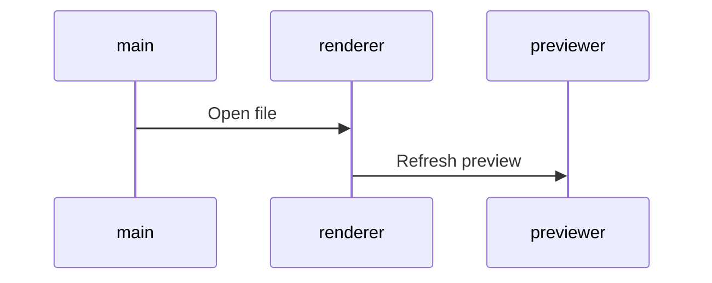

# planning

## priorités

- no comment

 <!-- | allBrand | news     | rPanier Abandonné                                    | 31/01/2019 | febrary | V1 à valider | Manu | -->

| <!--  | TL       | site                                                 | Bannière site Temps L - Facebook | 30/07/21 | jul | -   | Max |
| TL    | Site     | Encart animation Nav                                 | 29/06/21                         | jul      | -   | Max |     |
| TL+IP | newsBanr | La chaîne youtube et les vidéos                      | 29/06/21                         | jul      | -   | Max |     |
| TL+IP | newsBanr | La page Facebook                                     | 29/06/21                         | jul      | -   | Max |     |
| TL+IP | newsBanr | Catégorie générique :  mise en avant 3 ou 4 cat. pdt | 29/06/21                         | jul      | -   | Max |     |
| TL+IP | newsBanr | Réglez vos achats en 3x sans frais dès 75€*          | 29/06/21                         | jul      | -   | Max |     |
| TL+IP | newsBanr | Livraison en point relais                            | 29/06/21                         | jul      | -   | Max | --> |

<!-- [checked](./dl2020done.md)  -->
### à valider | à intégrer | [checked](./planmd_done.html)

| brand  | job       | intitulé                      | deadline   | date | état      |
| : ---: | --------- | -----------                   | ---------- | ---- | --------: |
| TL     | news      | anniversaire                  | 06/10/2020 | oct  | Prop v1   |
| TL     | landing   | anniversaire                  | 06/10/2020 | oct  | wip Manu  |
| TL     | news      | relance panier Dialog Insight | 23/09/2021 | oct  | v1d Max   |
| TL     | news      | Désabo inactifs               | 08/10/2021 | nov  | wip Max   |
| B2B    | news      | Prospection créa + routage    | 30/11/2021 | dec  | wip Max   |
| CD     | news      | Cata                          | 29/10/2021 | nov  | wip Manu  |

> Répartition des enseignes entre Damien et Nelty :

- Netly : MM - CD - HO (mais toujours mettre Damien et moi en copie car Nelty n'est présente que les jeudi et vendredi)
- Damien : TL/IDP - CV/VF - AL

### TL + ID

| brand | jobs  |             intitulé             | deadline | date | date-n |
| :---: | ----- | -------------------------------- | -------- | ---- | ------ |
|  TL   | news  | CD MM Licra                      | 06/11/21 | nov  | -      |
|  TL   | news  | Récup optin                      | 08/11/21 | nov  | -      |
|  TL   | news  | Bon pour porte-monnaie/planète   | 09/11/21 | nov  | -      |
|  TL   | HP    | décoIntNoël+PlatsMijotés+IdKdo   | 11/11/21 | nov  | -      |
|  TL   | news  | Soupe                            | 11/11/21 | nov  | -      |
|  TL   | news  | FDP offerts                      | 13/11/21 | nov  | -      |
|  TL   | news  | Relance FDP offerts              | 15/11/21 | nov  | -      |
| TL+IP | news  | rCat (Manu)                      | 18/11/21 | nov  | -      |
|  TL   | news  | Tenue de fête                    | 20/11/21 | nov  | -      |
| TL+IP | news  | Cata                             | 23/11/21 | dec  | -      |
| TL+IP | HP    | RepasNoël+TableNoël+IdKdo        | 24/11/21 | dec  | -      |
| TL+IP | bando | Réseaux sociaux                  | 25/11/21 | dec  | -      |
|  TL   | news  | Black Friday                     | 26/11/21 | dec  | -      |
|  TL   | HP    | Banner Black Friday/Cyber Monday | 26/11/21 | dec  | -      |
|  TL   | HP    | 10% sup                          | 26/11/21 | dec  | -      |

### AL

| brand | job  |          intitulé           | deadline | date | date-n |
| :---: | ---- | --------------------------- | -------- | ---- | ------ |
|  AL   | news | cata !mportant use workflow | 27/11/21 | dec  | -      |
|  AL   | news | Récupération optin          | 08/11/21 | nov  | -      |

### IDH

| brand | job  |          intitulé          | deadline | date | date-n |
| :---: | ---- | -------------------------- | -------- | ---- | ------ |
|  IDH  | HP   | Banr 10€ dès 50€           | 28/10/21 | oct  | -      |
|  IDH  | news | 10€ dès 50€ +encart promos | 28/10/21 | oct  | -      |
|  IDH  | news | Relance 10€ dès 50€        | 01/11/21 | nov  | -      |
|  IDH  | news | Récup optin                | 08/11/21 | nov  | -      |
|  IDH  | HP   | ID Cadeau Fin d'années     | 09/11/21 | nov  | -      |
|  IDH  | news | Cata (Manu)                | 11/11/21 | nov  | -      |
|  IDH  | news | 20% dès 30€ ou 40€         | 16/11/21 | nov  | -      |

### CD

| brand |  job   |   intitulé    | deadline | date | date-n |
| :---: | ------ | ------------- | -------- | ---- | ------ |
|  CD   | slides | Voir planning | 17/11/21 | dec  | -      |
|  CD   | news   | Cata          | 20/11/21 | dec  | -      |

### CV + VF

| brand | job  |          intitulé           | deadline | date | date-n |
| :---: | ---- | --------------------------- | -------- | ---- | ------ |
|  CV   | HP   | Jeu+IDkdo+ZD+Beauté en fête | 09/11/21 | nov  | -      |
|  CV   | news | Cata (Manu)                 | 11/11/21 | nov  | -      |
|  CV   | news | Noël                        | 20/11/21 | nov  | -      |
|  CV   | news | Cata                        | 29/11/21 | dec  | -      |

### MM

| brand | job  | intitulé | deadline | date | date-n |
| :---: | ---- | -------- | -------- | ---- | ------ |
|  MM   | HP   | ?        | 04/11/21 | nov  | -      |
|  MM   | news | Cata     | 06/11/21 | nov  | -      |

- Start 13 mars 2017
- Shared november 2018
- End

### infos

<pre>
  <code>
  - ctrl       = contrôle
  - nodef      = non définie
  - allb       = all brand
  - NOK        = Non OK
  - EC         = encart central
  - int        = intégration
  - trad       = version inter
  - v1 | v2... = à valider !important
  - wip        = job en cours
  - DPO        = Data Privacy Officer
  - EAN        = European Article Numbering
  </code>
</pre>

### Procédure pour utiliser le planing depuis un PC avec cmd

1. Lancer cmd touche windows et taper cmd.
2. vérifier que python est bien installé sur le PC : python --version (retour = Python 3.6.2 )
3. Si pas de python => [Download Windows x86-64 executable installer](https://www.python.org/downloads/windows/)

```cmd
# aller sur le disque marketing
cd /D K:\WEB\Manuel
# lancer le serveur python depuis cet emplacement (commande différente sur PC)
python -m http.server 8000
# selectionner planmd.html ça marche ?
```

Pour prévisualiser le planning l'adresse http://localhost:8000/planmd.html est disponible dans tous les navigateurs. Réaliser les modifications directement sur le serveur marketing (k:\ chez moi) ce qui permet de ne pas écrasser les modifications.

### TODO as soon as possible

_bash cmd_

<!-- - fct create $date_cov_folder <span style = "color: chartreuse;">OK > @see covcv C:\cygwin64\bin\</span> -->

- <span style = "color: chartreuse;">create new cmd mvCat mvLoc mvEvt > move img from optz to current folder.</span> - ok pour relance cat IDEAL cf fct/bin imgrcat arg1 arg2 BV DE etc...
- time notification
- regex-lookahead

_javascript_

- Evt > babel > auto create babelrc
- gulp remplacer progressivement les callback par des promises
- gulp ajouter la suppression des éléments dans le rendu - supp img ds dist si supp ds dev
- automatiser les variables les plus courantes

```javascript
$s1_accroche = $url+rayon+$IDray[:pays]+srcMedCont+auto(accroche)+$campaign
```

_design_

- transition Fireworks vers <s>adobe XD(maturité nok)</s> Affinity Designer ??? ou Sketch ( ++ prix bas : 80€/an -- OSX only ).

_Nodejs_

- install NVM (nodist) gestion de version Nodejs pour sécuriser flux production.

_Gulp_

- uniformiser les différents templates de news pour avoir un workflow strictement identique. - <span style = "color: chartreuse;">solution automatiser création des variables cf news rPannier</span>
- AL CD CV HO MM TL news catalogue
- TL ID news loco
- suppression des dossiers evtProd preview et zipped à chaque lancement de gulp dev <span style = "color: chartreuse;">TL(newsLoco/EC/ZL) ok</span>
- @see /cygdrive/c/Users/mdevries/Pictures/TL/evnt/first/0817/TH12_ete/code/evt - à propager sur toutes les enseignes et sur tous les postes.
- corriger le rendu des balises img sur deux lignes @see /cygdrive/c/Users/mdevries/Pictures/tl/newsLetter/loco/0917/OM8/HTML/BVNL/gulpfile.js

### résolution css spécifique aux news cross-client

- lien qui prend toute la place de son conteneur width et height
- d : table-cell; width: ..px; height: ..px; va: m; // cette solution ne fonctionne pas sur outlook 2014
- CV > re factorisation du code: pkX3 (loop ok img nok lib + link)

### Cheatsheet 

_img | list | title | code | etc..._

```css
.testColor {
  color: red;
}
```

```javascript
function test(arg) {
  return arg;
}
```

```html
<h1 class="testColor">Mon titre de niveau 1</h1>
```

```markdown
images:

```

```uiflow
[top page]
user name
password
--
login
 =  => mypage

[mypage]
favorite list
```



### Work in progress

```javascript
javascript les tests unitaires
  mocha (moka) qui tourne sur noyau node avec solution browser et dom
  npm chai (chaïlle) pour ajouter syntaxe deep.equal etc...
  @see gulp-mocha
```

### process
