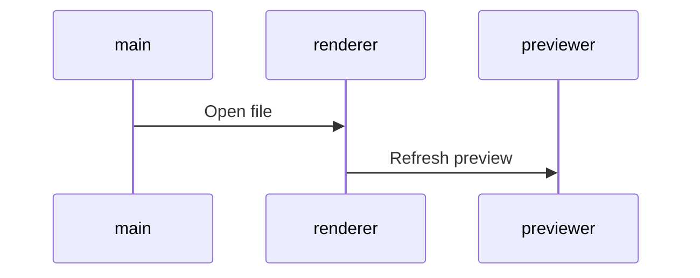

# planning

## priorités

- Marie Lefebvre Date : Lundi 23 mars 2020 09:07 objet : TR: CALL
- **titre modif**
- modif ttes enseignes
- 8H 17H du lundi au samedi FR et Belgique Wallonne Domoti //Becquet
- 8H 16H Lundi au vendredi NL/FL
- 9H 17H Lundi au vendredi DE
- 9H 17H heure locale Lundi au vendredi UK

<!-- | allBrand | news  | rPanier Abandonné        | 31/01/2019 | fev | V1 à valider | Manu | -->

<!-- [checked](./dl2020done.md)  -->
### à valider | à intégrer | [checked](./planmd_done.html)

| brand  | job       | intitulé                          | deadline   | date | état      |
| : ---: | --------- | -----------                       | ---------- | ---- | --------: |
| TL     | news      | relance panier Dialog Insight     | 22/09/2020 | oct  | v1c Max   |
| TL     | news      | anniversaire                      | 06/10/2020 | oct  | Prop v1   |
| TL     | Landing   | anniversaire                      | 06/10/2020 | oct  | wip Manu  |
| TL+IP  | news      | TH19 - Table de Noël              | 30/11/2020 | dec  | v1 Max    |
| TL     | bannieres | Black Week (27/11 : black Friday) | 04/12/2020 | dec  | wip Max   |

> Répartition des enseignes entre Damien et Nelty :

- Netly : MM - CD - HO (mais toujours mettre Damien et moi en copie car Nelty n'est présente que les jeudi et vendredi)
- Damien : TL/IDP - CV/VF - AL

### TL + ID

| brand  | jobs    | intitulé                     | deadline | date | date-n |
| : ---: | ------- | ---------------------------- | -------- | ---- | ------ |
| TL     | E2      | TH. Offres de Noël           | 07/12/20 | dec  | -      |
| TL     | news    | TH. Offres de Noël           | 07/12/20 | dec  | -      |
| TL+IP  | news    | Mondial Relay                | 07/12/20 | dec  | -      |
| TL     | news    | TH. Cuisine de Noël          | 07/12/20 | dec  | -      |
| TL     | news    | TH. Remail Offres de Noël    | 07/12/20 | dec  | -      |
| TL+IP  | news    | OM 1120 sauf UK et DE        | 07/12/20 | dec  | -      |
| TL+IP  | news    | TH19 - Remail Table de Noël  | 21/12/20 | dec  | -      |
| TL     | E1      | TH1 -  Bonne Année           | 28/12/20 | dec  | -      |
| TL+IP  | news    | TH1 -  Bonne Année           | 28/12/20 | dec  | -      |
| TL     | Site    | Encart animation Nav         | 29/12/20 | dec  | -      |
| TL+IP  | news    | API news>Claranet            | 29/12/20 | dec  | -      |

### AL

| brand | job  |    intitulé     | deadline | date | date-n |
| :---: | ---- | --------------- | -------- | ---- | ------ |
|  AL   | EC   | hp              | 23/12/20 | jan  | -      |
|  AL   | news | catalogue  J4WB | 23/12/20 | jan  | -      |

### HO

| brand | job  |    intitulé    | deadline | date | date-n |
| :---: | ---- | -------------- | -------- | ---- | ------ |
|  HO   | news | catalogue ESWB | 30/11/20 | dec  | -      |
|  HO   | EC   | hp             | 13/01/21 | jan  | -      |

### CD

| brand | job  | intitulé  | deadline | date | date-n |
| :---: | ---- | --------- | -------- | ---- | ------ |
|  CD   | news | catalogue | 31/12/20 | jan  | -      |
|  CD   | EC   | hp        | 21/12/20 | jan  | -      |

### CV + VF

| brand | job  |    intitulé    | deadline | date | date-n |
| :---: | ---- | -------------- | -------- | ---- | ------ |
|  CV   | news | catalogue 09WB | 01/12/20 | dec  | -      |
| CV+VF | EC   | hp             | 07/01/21 | jan  | -      |

### MM

| brand | job  | intitulé  | deadline | date | date-n |
| :---: | ---- | --------- | -------- | ---- | ------ |
|  MM   | EC   | hp        | 01/12/20 | dec  | -      |
|  MM   | news | catalogue | 01/12/20 | dec  | -      |

### SB

| brand | job | intitulé | deadline | date | date-n |
| :---: | --- | -------- | -------- | ---- | ------ |
|   S   | y   | b        | e        | ll   | e      |

- Start 13 mars 2017
- Shared november 2018
- End

### infos

<pre>
  <code>
  - ctrl       = contrôle
  - nodef      = non définie
  - allb       = all brand
  - NOK        = Non OK
  - EC         = encart central
  - int        = intégration
  - trad       = version inter
  - v1 | v2... = à valider !important
  - wip        = job en cours
  - DPO        = Data Privacy Officer
  - EAN        = European Article Numbering
  </code>
</pre>

### Procédure pour utiliser le planing depuis un PC avec cmd

1. Lancer cmd touche windows et taper cmd.
2. vérifier que python est bien installé sur le PC : python --version (retour = Python 3.6.2 )
3. Si pas de python => [Download Windows x86-64 executable installer](https://www.python.org/downloads/windows/)

```cmd
# aller sur le disque marketing
cd /D K:\WEB\Manuel
# lancer le serveur python depuis cet emplacement (commande différente sur PC)
python -m http.server 8000
# selectionner planmd.html ça marche ?
```

Pour prévisualiser le planning l'adresse http://localhost:8000/planmd.html est disponible dans tous les navigateurs. Réaliser les modifications directement sur le serveur marketing (k:\ chez moi) ce qui permet de ne pas écrasser les modifications.

### TODO as soon as possible

_bash cmd_

<!-- - fct create $date_cov_folder <span style = "color: chartreuse;">OK > @see covcv C:\cygwin64\bin\</span> -->

- <span style = "color: chartreuse;">create new cmd mvCat mvLoc mvEvt > move img from optz to current folder.</span> - ok pour relance cat IDEAL cf fct/bin imgrcat arg1 arg2 BV DE etc...
- time notification
- regex-lookahead

_javascript_

- Evt > babel > auto create babelrc
- gulp remplacer progressivement les callback par des promises
- gulp ajouter la suppression des éléments dans le rendu - supp img ds dist si supp ds dev
- automatiser les variables les plus courantes

```javascript
$s1_accroche = $url+rayon+$IDray[:pays]+srcMedCont+auto(accroche)+$campaign
```

_design_

- transition Fireworks vers <s>adobe XD(maturité nok)</s> Affinity Designer ??? ou Sketch ( ++ prix bas : 80€/an -- OSX only ).

_Nodejs_

- install NVM (nodist) gestion de version Nodejs pour sécuriser flux production.

_Gulp_

- uniformiser les différents templates de news pour avoir un workflow strictement identique. - <span style = "color: chartreuse;">solution automatiser création des variables cf news rPannier</span>
- AL CD CV HO MM TL news catalogue
- TL ID news loco
- suppression des dossiers evtProd preview et zipped à chaque lancement de gulp dev <span style = "color: chartreuse;">TL(newsLoco/EC/ZL) ok</span>
- @see /cygdrive/c/Users/mdevries/Pictures/TL/evnt/first/0817/TH12_ete/code/evt - à propager sur toutes les enseignes et sur tous les postes.
- corriger le rendu des balises img sur deux lignes @see /cygdrive/c/Users/mdevries/Pictures/tl/newsLetter/loco/0917/OM8/HTML/BVNL/gulpfile.js

### résolution css spécifique aux news cross-client

- lien qui prend toute la place de son conteneur width et height
- d : table-cell; width: ..px; height: ..px; va: m; // cette solution ne fonctionne pas sur outlook 2014
- CV > re factorisation du code: pkX3 (loop ok img nok lib + link)

### Cheatsheet 

_img | list | title | code | etc..._

```css
.testColor {
  color: red;
}
```

```javascript
function test(arg) {
  return arg;
}
```

```html
<h1 class="testColor">Mon titre de niveau 1</h1>
```

```markdown
images:

```

```uiflow
[top page]
user name
password
--
login
 =  => mypage

[mypage]
favorite list
```



### Work in progress

```javascript
javascript les tests unitaires
  mocha (moka) qui tourne sur noyau node avec solution browser et dom
  npm chai (chaïlle) pour ajouter syntaxe deep.equal etc...
  @see gulp-mocha
```

### process
